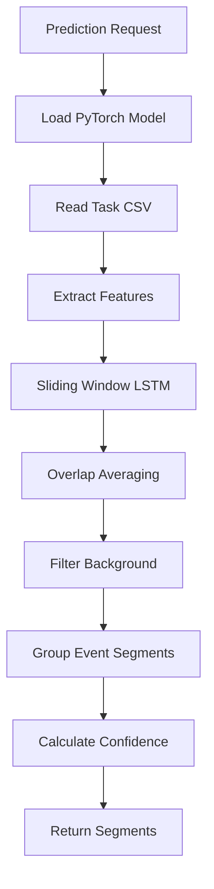

B{Training Trigger?}
  B -- no --> C[Skip Training]
  B -- yes --> D[Fetch Labeled Tasks]
  D --> E[Process Annotations]
  E --> F{Ground Truth?}
  F -- yes --> G[Priority Processing]
  F -- no --> H[Standard Processing]
  G --> I[Generate Samples]
  H --> I
  I --> J[Background + Event Labels]
  J --> K[PyTorch LSTM Training]
  K --> L[Model Validation]
  L --> M[Save Model]
  M --> N[Cache in Memory]
```

### Prediction Pipeline



### Key Technical Features

- **PyTorch-based LSTM**: Modern deep learning framework with better performance and flexibility
- **Temporal Modeling**: Sliding windows capture time dependencies (default 50 timesteps)
- **Background Class**: Realistic modeling where unlabeled periods are explicit background
- **Balanced Learning**: Class-weighted loss function and balanced metrics for imbalanced data
- **Instant Label Support**: Proper handling of point events (`instant=true`) vs. duration events (`instant=false`)
- **Smart Early Stopping**: Dual criteria (balanced accuracy + minimum per-class F1) prevent premature stopping
- **Ground Truth Priority**: Ensures highest quality annotations are used for training
- **Overlap Averaging**: Smoother predictions through overlapping window consensus
- **Project-Specific Models**: Each Label Studio project gets its own trained model for proper multi-tenant isolation

## Customize

Edit `docker-compose.yml` to set environment variables for your specific use case:

### Basic Configuration
```yaml
environment:
  - LABEL_STUDIO_HOST=http://localhost:8080
  - LABEL_STUDIO_API_KEY=your_api_key_here
  - MODEL_DIR=/app/models
  - START_TRAINING_EACH_N_UPDATES=1
  - TRAIN_EPOCHS=1000
  - SEQUENCE_SIZE=50
  - HIDDEN_SIZE=64
```

### Balanced Learning (Recommended for Instant Labels)
```yaml
environment:
  # ... basic config above ...
  - BALANCED_ACCURACY_THRESHOLD=0.85
  - MIN_CLASS_F1_THRESHOLD=0.70  
  - USE_CLASS_WEIGHTS=true
```

### Common Scenarios

**For instant labels (point events):**
- Keep balanced learning enabled (`USE_CLASS_WEIGHTS=true`)
- Consider lower thresholds (`MIN_CLASS_F1_THRESHOLD=0.60`) for very rare events
- Increase epochs (`TRAIN_EPOCHS=2000`) for better minority class learning

**For range annotations with balanced data:**
- Can disable class weights (`USE_CLASS_WEIGHTS=false`) if classes are roughly equal
- Use standard accuracy thresholds

**For short time series:**
- Reduce sequence size (`SEQUENCE_SIZE=20`) for sequences shorter than 50 timesteps
- Reduce hidden size (`HIDDEN_SIZE=32`) to prevent overfitting